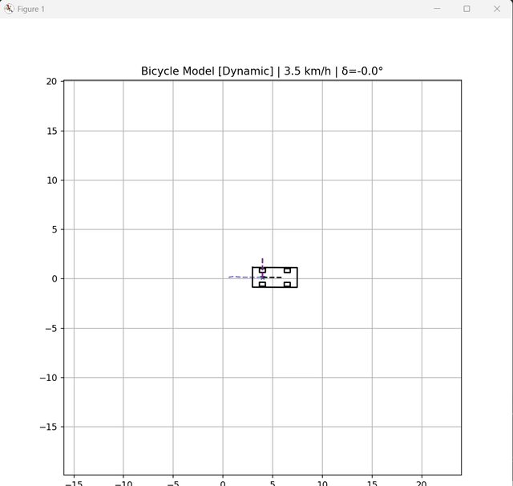

#  2D Bicycle Model Vehicle Dynamics Simulation

A simple 2D car simulation built with Python, Pygame, and Matplotlib. It simulates car physics, steering, and movement in real-time.

---

##  Demo Video



*Direct video file: [`output.mp4`](output.mp4)*

---

##  About the Project

- **Vehicle Physics**: Models car steering and acceleration using the **Bicycle Model**.
- **Dual Physics Modes**:
  - **Kinematic Mode** (Low Speed): Smooth low-speed maneuvering.
  - **Dynamic Mode** (High Speed): Simulates tire friction, side-slip, and drift physics.
- **Real-Time Display**: Shows car body, turning front wheels, IMU direction axes, and driving path history.

---

## Controls

| Key | Action |
| --- | --- |
| **W** / **Up Arrow** | Accelerate |
| **S** / **Down Arrow** | Brake / Reverse |
| **A** / **Left Arrow** | Steer Left |
| **D** / **Right Arrow** | Steer Right |
| **R** | Reset Car Position |

---

## How to Run

### 1. Install Dependencies
```bash
pip install pygame matplotlib numpy
```

### 2. Run Simulation
```bash
python help.py
```
